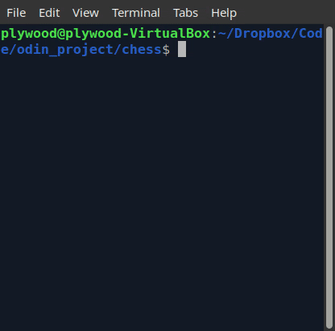

# Command-Line Chess Game in Ruby
Final project for the Ruby curriculum at [The Odin Project](https://www.theodinproject.com/lessons/ruby-ruby-final-project)

## Demo

## How to play
### Online
https://replit.com/@Plywood/chess

### Locally
Prerequisites
- Ruby 3.0.3 (Ruby 2 will probably work)

- Clone this repo
- Navigate to project directory
- Run `ruby main.rb`

Known issue: your chess game will look slightly different on other command line interfaces

## Project Requirements
2-Player Game with legal moves

Save and load games

Tests using Rspec

## Post-Project Notes
- This was the **largest project** I’ve ever completed to date
- **Writing tests was invaluable** as the project increased in complexity. I tried test-driven development but decided against it because of the unfamiliar complexity of the project. It triggered overthinking and decision paralysis.
- I need to learn design patterns to keep my code clean and be better at TDD.
- **Usability** was important to me. I created (1) a visual representation of possible moves when a piece is selected, (2) an ability to redo piece selection if user changes their mind, (3) only prompts user to restore a save game if one exists
- Chess moves are only legal if it doesn’t put your own king in check. I broke a lot of tests when integrating MoveValidator#remove_moves_jeopardize_king into #valid_moves. Fixed by doing a **major refactor** of #valid_moves. Split into #valid_moves and #estimate_moves
- First experience creating **tech debt**. Move validation methods were originally written in the ChessBoard class. Half way through writing these methods, I realized creating a separate MoveValidator class was more proper. I created more work than necessary by waiting until ChessBoard was finished before creating MoveValidator. 
- Learned some **advanced Git**. I accidentally pushed code with bugs to remote.  Learned how to use git reflog and git checkout to go back into time when code worked to begin debugging. Will prevent this in the future by running my tests before every push to remote. 
- Early design decision of storing the board as a hash made debugging much easier. I could enter a coordinate as it appears on the board (a3) as opposed to row=1, col = 3 of a 2D array.
- The game looks different between different command line interfaces. Decided against fixing this because of advice that CLI output isn’t usually used to render something this complex. It would not be a useful skill.

## Further work

- Chess game rules: En passant attack by Pawn, Castling between King/Castle. Dead position game over condition. 
- Create a module for printing game messages and taking input. Would make ChessGame more readable
- Use [design patterns](https://www.amazon.com/Design-Patterns-Ruby-Russ-Olsen/dp/0321490452) to standardize methods and “do not repeat yourself”
- Create a module that stores each move in algebraic notation
- Player 2 with basic automation so that it picks a random moves
- Player 2 with advanced automation from a chess agent

